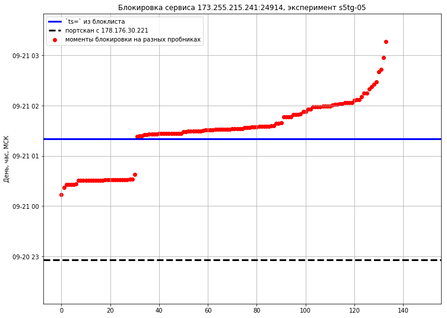

Данные к [докладу](https://slides.ooni.io/2018/CIF/) на [CryptoInstallFest 5 (22 сентября 2018)](https://cryptofest.ru/).

tl;dr
=====

Предположительно:

- МаксимаТелеком или аплинки ([МТС](traceroute/2018-09-20-16-11-03.png)? [Мегафон](traceroute/2018-09-20-16-10-42.png)?) слушают трафик в поисках Socks5 проксей
- по результатам "прослушки" [ходит сканер](scanner-pcap/)
- некоторые провайдеры блокируют IP адреса раньше, чем РКН добавляет адрес в "общие" выгрузки

Детали
======

При использовании Socks5 для соединения с Telegram из сети `MT_FREE`
Московского Метро (провайдер МаксимаТелеком) через полчаса-час на адрес Socks5
приходит сканер с адреса `178.176.30.221` из "клиентской" [сети Мегафона](https://stat.ripe.net/178.176.30.221),
судя по PTR записям вида `clients-221.30.176.178.misp.ru.`.

Сканер портов проверят доступность TCP порта полу-открытым сканированием (SYN, SYN-ACK, RST).
После успешной проверки сканер пытается установить Socks5 соединение с сервером
из подсети Telegram `91.108.56.186:443` и произвести обмен данными с ним.

Через час-полтора после прихода сканера _НЕКОТОРЫЕ_ провайдеры начинают блокировать
доступ к просканированному серверу: МГТС, МТС, Мегафон, Yota, Билайн и др.

Ещё через час-полтора IP адрес появляется в "выгрузке" и "дельтах", при этом
отметка времени `ts` у IP-адреса соответствует времени появления в выгрузке и
"отстаёт" от времени начала блокировки на выделенных провайдерах.

Механика эксперимента
=====================

- установить [haproxy](ansible/templates/haproxy.cfg), перенаправляющий Socks5 и TLS трафик на разные бэкенды (nginx с [preread](http://nginx.org/en/docs/stream/ngx_stream_ssl_preread_module.html) работать не будет, т.к. он читает минимум 5 байт, а первый пакет хэндшейка Socks5 &mdash; 3 или 4 байта)
- выделить зонды RIPE Atlas в России, которые находятся в сетях, фильтрующих по списку РКН
- запустить измерение SSLCert на сервер с этих зондов с периодичностью 3 минуты для проверки доступности TCP порта
- перевести телефон в оффлайн
- сконфигурировать Telegram на использование сервера
- подключиться к сети `MT_FREE` в метро, сделать круг по кольцевой линии, отключиться от `MT_FREE`
- удалить прокси-сервер из Telegram клиента (чтоб случайно не подключиться к нему через оператора сотовой связи или другого провайдера)
- подождать несколько часов и завершить измерение через RIPE Atlas

Таймлайн эксперимента s5tg-01
=============================

- 00:32 приход сканера
- 00:47 наблюдается блокировка на Yota
- 00:52 наблюдается блокировка на МГТС
- 01:38 в выгрузке с `updateTime="2018-09-20T01:38:00+03:00"` ещё нет блокировки
- 01:57 блэкхол на [looking glass Beeline](lg/beeline-2018-09-20-02-00-02.png)
- 03:07 в выгрузке с `updateTime="2018-09-20T03:07:00+03:00"` всё ещё нет блокировки
- 03:30 `<ip ts="2018-09-20T03:30:00+03:00">45.56.118.171</ip>`

Графики по другим эксприментам с данными RIPE Atlas:

- [s5tg-02](https://nbviewer.jupyter.org/github/darkk/rkn-git-flow/blob/master/atlas-vis-02.ipynb)
- [s5tg-03](https://nbviewer.jupyter.org/github/darkk/rkn-git-flow/blob/master/atlas-vis-03.ipynb)
- [s5tg-04](https://nbviewer.jupyter.org/github/darkk/rkn-git-flow/blob/master/atlas-vis-04.ipynb)
- [s5tg-05](https://nbviewer.jupyter.org/github/darkk/rkn-git-flow/blob/master/atlas-vis-05.ipynb)

Спасибо
=======

- сообществу [CTF в Петербурге](https://t.me/spbctf) за королевский подгон багофичи сети `MT_FREE` в МосМетро
- [Неугомонному Филу](http://usher2.club/) и его источникам за данные о "выгрузках"
- [Дмитрию R16 Морозовскому](https://t.me/Dmarck) за данные о "дельтах"
- проекту [RIPE Atlas](https://atlas.ripe.net/landing/get-involved/) и операторам зондов за измерительный инструмент
